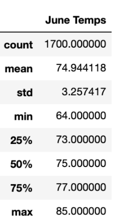

# Surfs Up!
Analyzing Weather Patterns with sqlite to find evidence supporting the opening of a surf shop in Oahu.

### Resources
- Database: hawaii.sqlite

<strong>Technologies Used:</strong>
- Python 3.7.6
- Jupyter Notebooks
- Sqlite databases

## Purpose of Analysis
The purpose of this analysis is to explore the weather conditions in Oahu throughout the year. If there are unfavorable conditions to opening up a surf shop and ice cream store, then it may not be in the best of our interest to do so. For the sake of this analysis, we're going to call any temperature above 70 degrees F "favorable" to beach weather, and anything lower to be "unfavorable".

## Results
After running the sqlite queries, we found the following insights:

### June Data
  
With June, the average temperature is roughly 75 degrees F. Also, with a minimum temperature of 64F and a max of 85F, there seem to be a lot of good warm days in Oahu during the month of June.

### December Data
  
The month of December, however, is a little different (but not much!). The average lingers at roughly 71F, which is slightly colder than June's data. With a minimum temperature of 56F and a max of 83F, the range of temperatures increases a bit, but not by a lot when compared to June's data.

Based on the data for both months, we've noticed the following:
-  Both June and December have maximum temperatures that are similar, being 85F and 83F, respectively. This can imply that there hot days occur in both months. Even the cold days don't get too cold, with minimum temperatures of 64 and 56 degrees F for both June and December, respectively. 
-  The average temperatures are great beach/surf weather, at roughly 74 and 71 degrees F for both June and December, respectively. 
-  The standard deviation is something to point out here. With June with a std deviation of ~3.26F, it is less than December's ~3.75F std deviation. When we look at the quartiles, we can see one point of concern - the bottom 25% quartile of temperatures. With June having a lower 25% of 73F, it is still a fairly good beach weather to have. However, December's lower 25% quartile of 69F, it may be just a bit closer to a chilly temperature. Therefore, in opening the store, we should note that about 25% of the time in December there will be slightly unfavorable conditions.

## Summary
Given that the temperatures dip only slightly in December, it seems that both samples of the months have "beach worthy" temperatures most of the time, which would help to provide favorable conditions to keeping the store open. Even the average temperatures vary by 4 degrees F, which is very little variation since the months we are evaluating are a summer and a winter month. 

### Additional Queries
To enhance our analysis for weather data in Oahu, we could contribute with the following queries:
1. <strong>Rain Data</strong>: Since this analysis only recognized the temperature differences, it did not measure the differences in rain data. Based on the store intending to be both a surfshop and an ice cream stand, both of these are dependent on weather. Having this data available would make us better suited to make a well-informed decision to open the stand or not. To do this in the sqlite db, we can add the "prcp" column into our analysis.
2. <strong>Water Data (Temperature and Wave Heights)</strong>: When the water in Oahu is warmer, people are more likely to have a full "beach day", meaning they spend the whole day at the beach. If the surf shop is located near the beach, then the customers that hang around the beach all day will be more likely to go to the store and purchase something. However, during different months in Oahu, water temperatures vary by which side of the island you're on. For example, during the winter in Oahu the north shore becomes a predominant spot for surfing. This will mean that waves are dangerous to regular tourists, but more favorable for extreme surfers. At this time of the year, one can expect more surfboard sales and less ice cream sales. Having the complete set of this data however, would help us make better informed decisions on which inventory to stock up on at what points in the year.