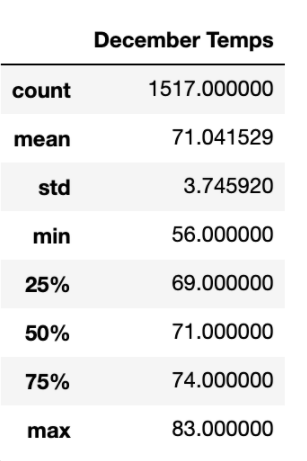

# Surfs Up!
Analyzing Weather Patterns with sqlite to find evidence supporting the opening of a surf shop in Oahu.

### Resources
- Database: hawaii.sqlite

<strong>Technologies Used:</strong>
- Python 3.7.6
- Jupyter Notebooks
- Sqlite databases

## Purpose of Analysis
The purpose of this analysis is to explore the weather conditions in Oahu throughout the year. If there are unfavorable conditions to opening up a surf shop and ice cream store, then it may not be in the best of our interest to do so.

## Results
After running the sqlite queries, we found the following insights:

### June Data
  
With June, the average temperature is roughly 75 degrees F. With a minimum temperature of 64F and a max of 85F, there is a lot of good warm days in Oahu during the month of June.

### December Data
  
The month of December, however, is a little different (but not much!). The average lingers at roughly 71F, which is slightly colder than June's data. With a minimum temperature of 56F and a max of 83F, the range of temperatures increases a bit, but not by a lot when compared to June's data.

Based on this, we've noticed the following:
-  Both June and December have maximum temperatures that are similar, being 85F and 83F, respectively. 
-  The average temperatures are great beach/surf weather 

## Summary
Given that the temperatures dip only slightly in December, it seems that both samples of the months have "beach worthy" temperatures, which would help to provide favorable conditions to keeping the store open. Even the average temperatures vary by 4 degrees F, which is very little variation since the months we are evaluating are a summer and a winter month. 

### Additional Queries
To enhance our analysis for weather data in Oahu, we could contribute with the following queries:
1. <strong>Rain Data</strong>: Since this analysis only recognized the temperature differences, it did not measure the differences in rain data. Based on the store intending to be both a surfshop and an ice cream stand, both of these are dependent on weather. Having this data available would make us better suited to make a well-informed decision to open the stand or not.  
2. <strong></strong>: